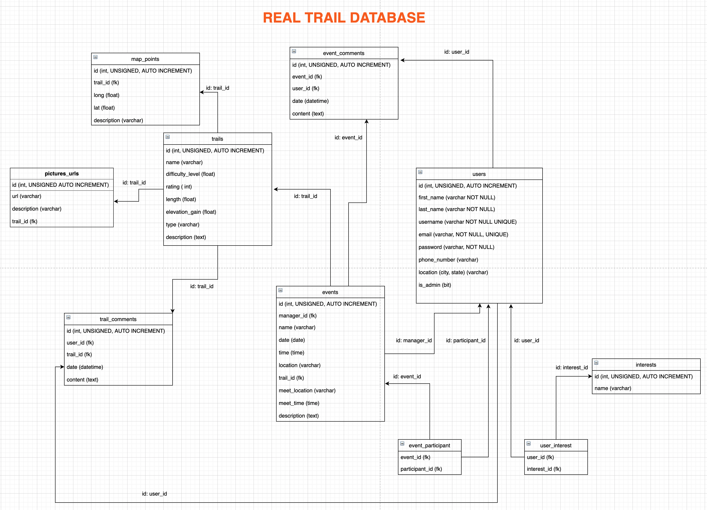

# realtrail-capstone

## Deployed
[realtrail.quest](https://realtrail.quest)

## Running the project (IntelliJ)
Clone the repository to your local machine
Rename or make a copy of the example.properties file in src>main>resources and name it application.properties.
The username and the password will need to be updated by the one you want to use for the database user on your local machine.
You need to signup for for the [Filestack API](https://www.filestack.com/) and insert your API key into the application.properties as well as
the [Mapbox API](https://www.mapbox.com/). Sign up for Mailtrap and input the username and password in the "spring.mail.username/password", which is also found in the
application.properties file. All other API will be generated automatically as well as the database using SrpingBoot in JAVA. 

IntelliJ should automatically pickup that this is a Spring Boot application and allow you to start the backend, which runs at localhost:8080, from the configurations menu.

## Description
RealTrail is a fitness activity website used for outdoor activities centered around trail routes such as walking, running, hiking, or cycling. RealTrail allows users to create events and connect with other users allowing the ease of group activity scheduling. All users can participate in an event and have the ability to share their experiences by adding trail photos, ratings, post comments, or provide route information. The service allows users creating events to create a custom trail where specific meet locations become the starting points or incorporating different trails into one route.

## Tech

This application leverages:
* HTML
* CSS
* JavaScript
* Java
* Spring Boot 
* Thymeleaf
* MYSQL
* AJAX
* Filestack
* JQuery
* API
* Mapbox GL JS
* Directions API
* Open Street Map
* Direction API
* Full Calendar API

## Real Trail Table

## 

## Collaborators
[Shanshan Su](https://github.com/shanshan-su)

[Karla Jara](https://github.com/karla-jara)

[Salim Ahmedabadi](https://github.com/salimk785)

[Victor Hernandez](https://github.com/Victor-G87)

[Emmanuel Stephen](https://github.com/Manii-dot)

## License
MIT © Real Trail 