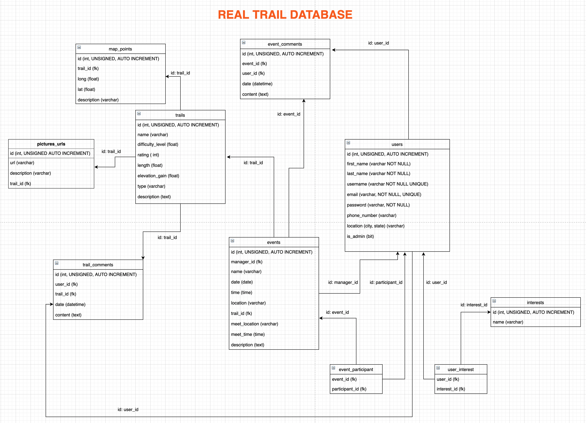

# realtrail-capstone

## Deployed
[realtrail.quest](https://realtrail.quest)

## Description
RealTrail is a fitness activity website used for outdoor activities centered around trail routes such as walking, running, hiking, or cycling. RealTrail allows users to create events and connect with other users allowing the ease of group activity scheduling. All users can participate in an event and have the ability to share their experiences by adding trail photos, ratings, post comments, or provide route information. The service allows users creating events to create a custom trail where specific meet locations become the starting points or incorporating different trails into one route.

## Tech

This application leverages:
* HTML
* CSS
* JavaScript
* Java
* Spring Boot 
* Thymeleaf
* MYSQL
* AJAX
* Filestack
* JQuery
* API
* Mapbox GL JS
* Directions API
* Open Street Map
* Direction API
* Full Calendar API

## Real Trail Table

## 

## Collaborators
[Shanshan Su](https://github.com/shanshan-su)

[Karla Jara](https://github.com/karla-jara)

[Salim Ahmedabadi](https://github.com/salimk785)

[Victor Hernandez](https://github.com/Victor-G87)

[Emmanuel Stephen](https://github.com/Manii-dot)

## License
MIT © Real Trail 